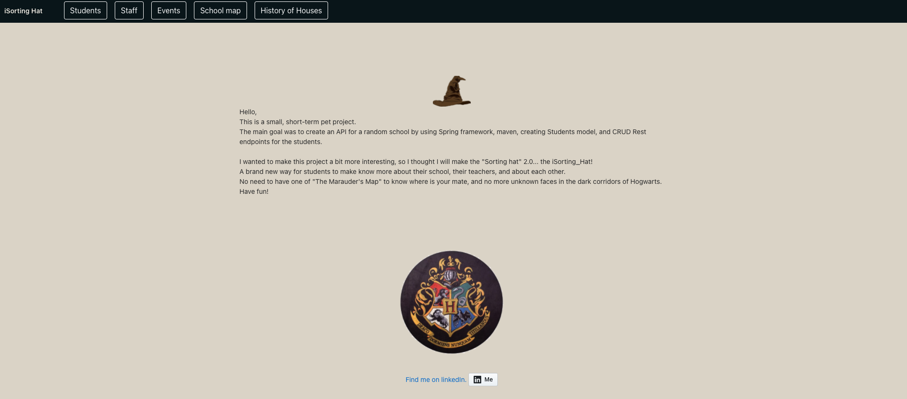
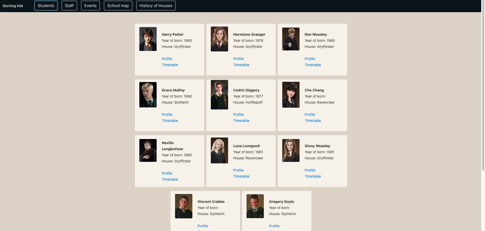
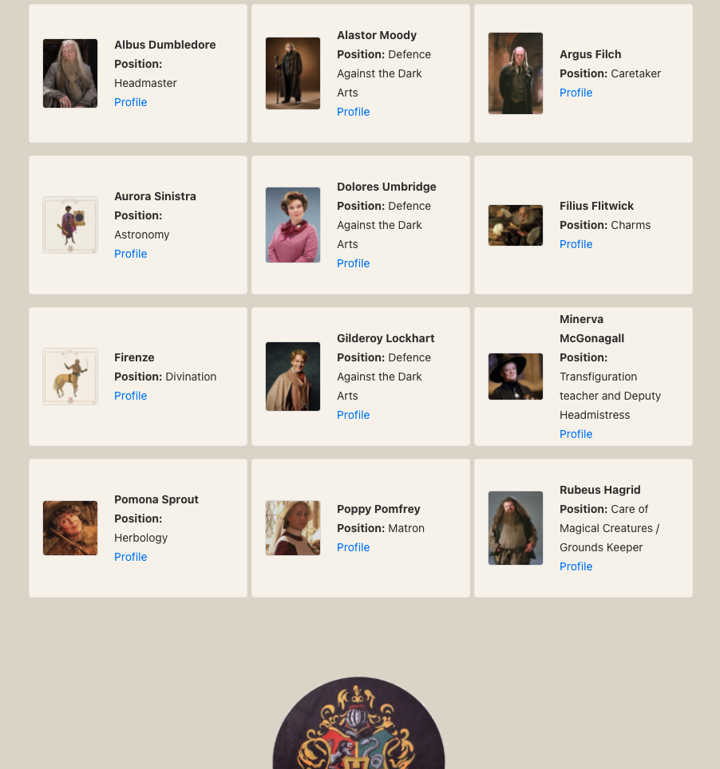
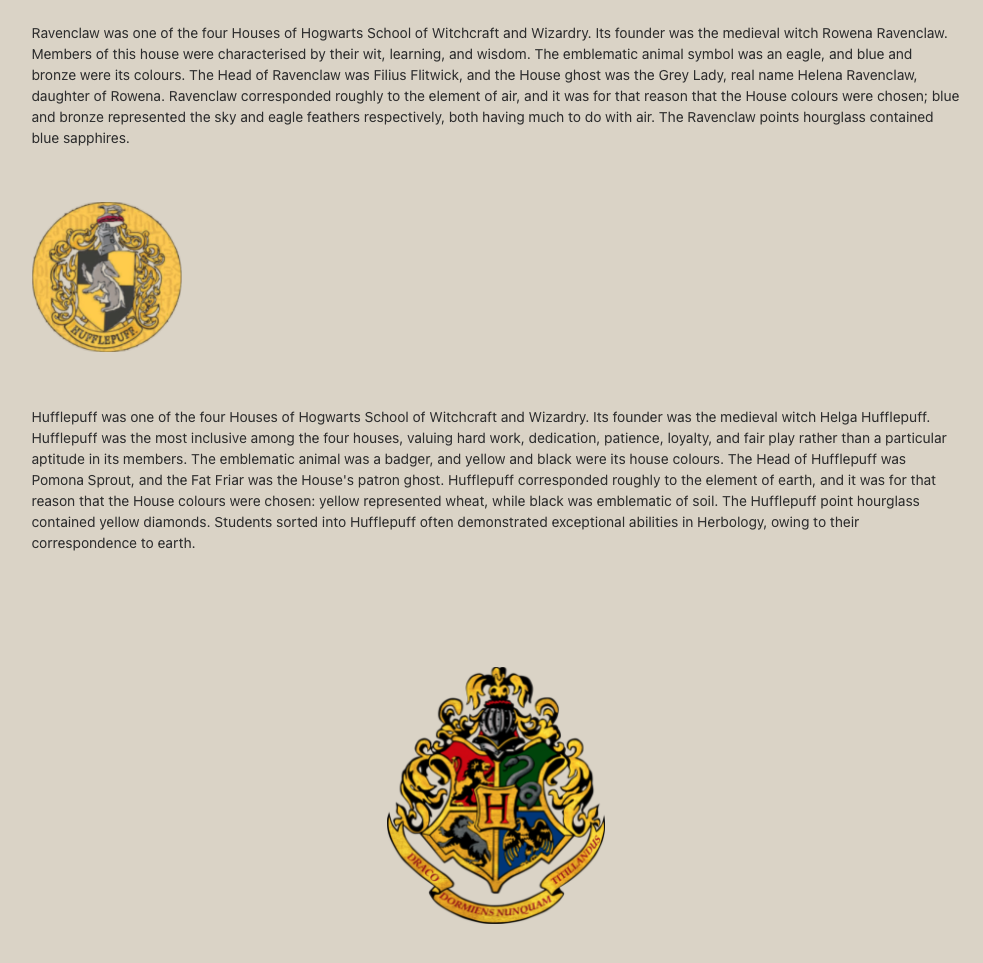

# BackStory
Hello, 
This is a small, short-term pet project. 
The main goal was to create an API for a random school by using Spring framework, maven, creating Students model, and CRUD Rest endpoints for the students.
I wanted to make this project a bit more interesting, so I thought I will make the "Sorting hat" 2.0... the iSorting_Hat! 
A brand new way for students to make know more about their school, their teachers, and about each other. 
No need to have one of "The Marauder's Map" to know where is your mate, and no more unknown faces in the dark corridors of Hogwarts.

# Technology Stack:
- Spring Boot
- Java 8
- Continuous Deployment 
- Pipeline (DevOps)
- Docker
- Bootstrap
- Angular 7 

# Homepage
   
# Students

# Teachers 
   
# Map

# History
   

# iSorting_hatheroku
