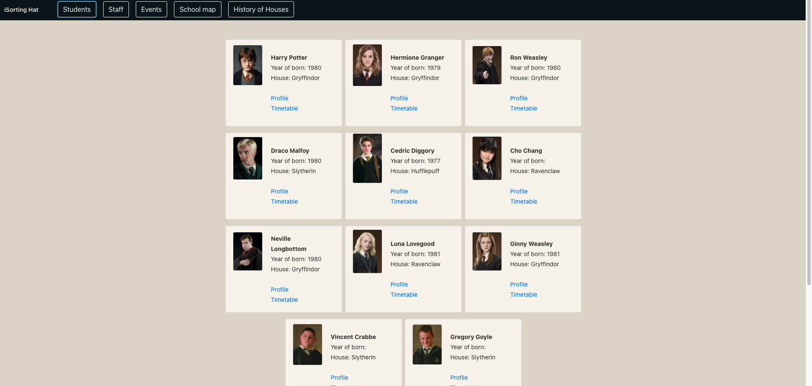
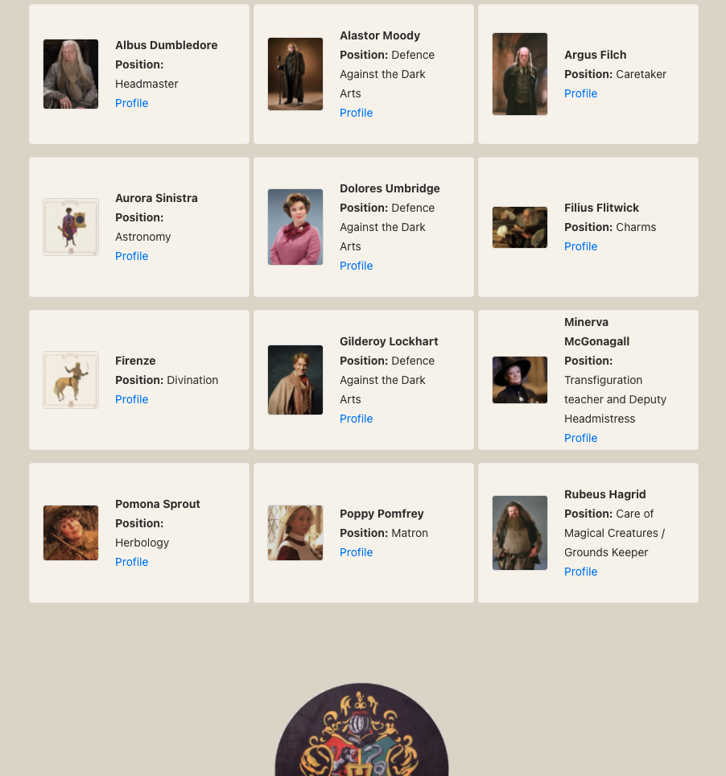
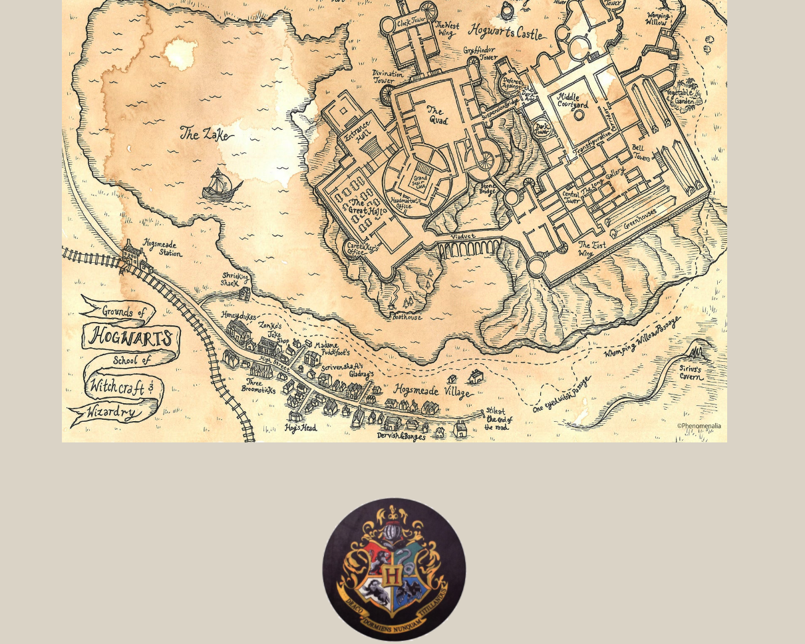

# BackStory
Hello, 
This is a small, short-term pet project. 
The main goal was to create an API for a random school by using Spring framework, maven, creating Students model, and CRUD Rest endpoints for the students.
I wanted to make this project a bit more interesting, so I thought I will make the "Sorting hat" 2.0... the iSorting_Hat! 
A brand new way for students to make know more about their school, their teachers, and about each other. 
No need to have one of "The Marauder's Map" to know where is your mate, and no more unknown faces in the dark corridors of Hogwarts.

# Technology Stack:
- Spring Boot
- Java 8
- Continuous Deployment 
- Pipeline (DevOps)
- Docker
- Bootstrap
- Angular 7 

# Homepage
   
# Students

# Teachers 
   
# Map

# History
   

------------------------------------------------------------------------------------------------------------------------
# SchoolappDash

This project was generated with [Angular CLI](https://github.com/angular/angular-cli) version 13.1.2.

## Development server

Run `ng serve` for a dev server. Navigate to `http://localhost:4200/`. The app will automatically reload if you change any of the source files.

## Code scaffolding

Run `ng generate component component-name` to generate a new component. You can also use `ng generate directive|pipe|service|class|guard|interface|enum|module`.

## Build

Run `ng build` to build the project. The build artifacts will be stored in the `dist/` directory.

## Running unit tests

Run `ng test` to execute the unit tests via [Karma](https://karma-runner.github.io).

## Running end-to-end tests

Run `ng e2e` to execute the end-to-end tests via a platform of your choice. To use this command, you need to first add a package that implements end-to-end testing capabilities.

## Further help

To get more help on the Angular CLI use `ng help` or go check out the [Angular CLI Overview and Command Reference](https://angular.io/cli) page.
# iSorting_hat_front
